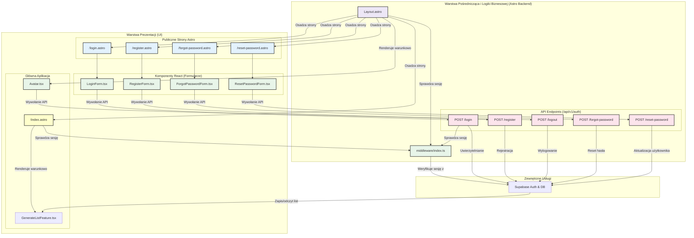

<architecture_analysis>
1.  **Wypis komponentów:**
    *   **Strony Astro:** `login.astro`, `register.astro`, `forgot-password.astro`, `reset-password.astro`, `auth/callback.astro`. Zmodyfikowane zostaną `index.astro` i `src/layouts/Layout.astro`.
    *   **Komponenty React:** `LoginForm.tsx`, `RegisterForm.tsx`, `ForgotPasswordForm.tsx`, `ResetPasswordForm.tsx`.
    *   **Layout:** `src/layouts/Layout.astro`.
    *   **Middleware:** `src/middleware/index.ts`.
    *   **API Endpoints:** `/api/v1/auth/login`, `/api/v1/auth/register`, `/api/v1/auth/logout`, `/api/v1/auth/forgot-password`, `/api/v1/auth/reset-password`.

2.  **Główne strony i ich komponenty:**
    *   `login.astro` renderuje `LoginForm.tsx`.
    *   `register.astro` renderuje `RegisterForm.tsx`.
    *   `forgot-password.astro` renderuje `ForgotPasswordForm.tsx`.
    *   `reset-password.astro` renderuje `ResetPasswordForm.tsx`.
    *   `Layout.astro` dynamicznie wyświetla linki logowania/rejestracji lub awatar użytkownika.
    *   `index.astro` warunkowo renderuje główną funkcjonalność (`GenerateListFeature`) tylko dla zalogowanych użytkowników.

3.  **Przepływ danych:**
    *   Użytkownik (gość) wchodzi na stronę publiczną (np. `/login`).
    *   `Layout.astro` (przez middleware) nie znajduje sesji i wyświetla przyciski "Zaloguj" i "Zarejestruj".
    *   Komponent React (np. `LoginForm.tsx`) obsługuje formularz i wysyła dane do odpowiedniego endpointu API Astro (`/api/v1/auth/login`).
    *   Endpoint API komunikuje się z Supabase w celu autentykacji.
    *   Po pomyślnej autentykacji, Supabase ustawia cookies sesji, a użytkownik jest przekierowywany na stronę główną.
    *   Middleware przechwytuje nowe żądanie, weryfikuje sesję z cookies i udostępnia ją w `Astro.locals`.
    *   `Layout.astro` i `index.astro` renderują widok dla zalogowanego użytkownika.

4.  **Opis funkcjonalności:**
    *   **Strony `.astro`:** Służą jako "szkielety" HTML, które osadzają w sobie interaktywne komponenty React.
    *   **Komponenty `.tsx`:** Zarządzają stanem formularzy, walidacją po stronie klienta i komunikacją z API.
    *   **`Layout.astro`:** Główny szablon strony, który dostosowuje UI (nagłówek) w zależności od stanu zalogowania.
    *   **`middleware/index.ts`:** Kluczowy element architektury; uruchamiany przy każdym żądaniu, weryfikuje sesję użytkownika i udostępnia ją w kontekście Astro, chroniąc strony i endpointy.
    *   **Endpointy API:** Logika serwerowa, która bezpiecznie komunikuje się z Supabase Auth, izolując klucze API od frontendu.

</architecture_analysis>
<mermaid_diagram>

</mermaid_diagram>